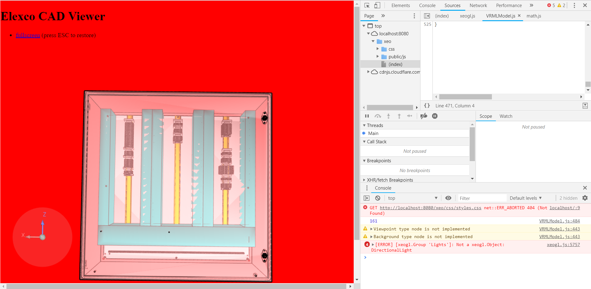

# -xeogl.VRMLModel

I simple VRML model parser for Xeogl.

Use and based on https://github.com/bartmcleod/VrmlParser 

Based on THREEJS VRMLLoader

## Todo

- Not all node are pushed in the tree.
- Texture load UVS
- Fix light
- All node...
## Picture

